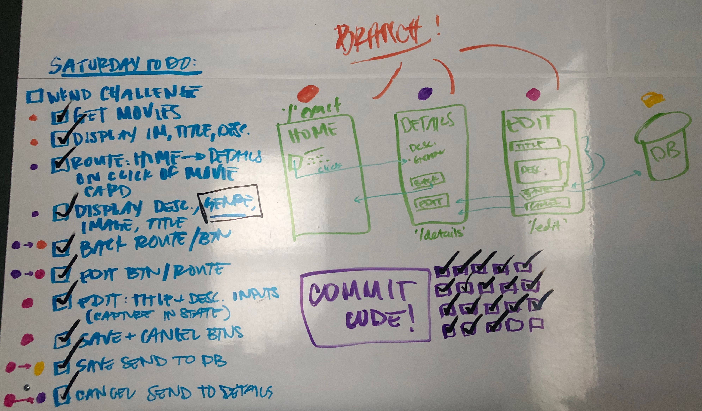

# React-Redux with Sagas, Movie List
Duration: Weekend Challenge (2 days) for Prime Digital Academy's Tier 2 Week 13.

## Description
This project stores movie information, including each movie's poster, title, associated genres, and description. Each movie's title and desctiption can be edited by the user.

## Project Organization
Whiteboard to do task organization and wireframing

## Installation
1. Run `npm install` in your terminal
2. Run `npm run server` in your terminal
3. Run `npm run client` in your terminal (this will open a new browser in your tab)
4. Create a database called `saga_movies_weekend`
5. Copy and past the query text in the database.sql file and run in that database in Postico. 

## Usage
The homepage will display the list of movies stored in the database with their poster, title, genres, and description. Click on any movie poster to get the details of that movie. 'Back to Movie List' will bring you back to the all movies list. 'Edit' will bring you to a page in which you can edit the title and description of that movie. 'Cancel Edits' will bring you back to the details page of that movie. 'Save Edits' will send your changes to the server and database, permanently changing the movie title and description of that movie based on your edits. 

## Built With
React, React-Redux, Redux-Logger, Redux-Saga, Axios, PG, Postico (M-M junction), Reducers, and Routers.